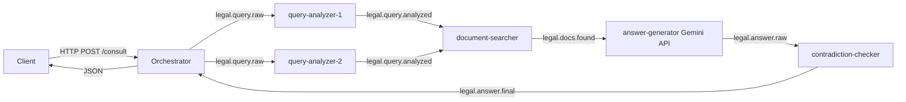

# Архитектура системы — Юридическая консультация (Вариант 21)

## Pipeline агентов



## NATS Topics

| Subject               | Producer              | Consumer                |
|-----------------------|-----------------------|-------------------------|
| legal.query.raw       | Orchestrator          | query-analyzer x2       |
| legal.query.analyzed  | query-analyzer        | document-searcher       |
| legal.docs.found      | document-searcher     | answer-generator        |
| legal.answer.raw      | answer-generator      | contradiction-checker   |
| legal.answer.final    | contradiction-checker | Orchestrator            |

## Redis ключи

| Ключ                        | Тип    | TTL   | Содержимое                   |
|-----------------------------|--------|-------|------------------------------|
| agent:{id}:status           | String | 60s   | idle/busy                    |
| agent:{id}:tasks_processed  | String | —     | счётчик INT                  |
| docs:{query_type}           | String | 300s  | JSON список документов       |
| answer:{task_id}            | String | 600s  | финальный ответ LLM          |
| scaled_agents               | Set    | —     | container_id                 |

## Алгоритм аукциона

Bid = `tasks_processed` если `status=idle`, `1000` если `busy`.

Победитель = `argmin(bid)`, исключая `bid >= 1000`.

Логируется каждый раунд в stdout в формате JSON:

```json
{
  "participants": [{"agent_id": "...", "role": "...", "bid": 0, "status": "idle"}],
  "winner": {"agent_id": "...", "role": "...", "bid": 0}
}
```

## Динамическое масштабирование

Оркестратор каждые 10 секунд опрашивает NATS Monitoring API (`http://nats:8222/subsz`).

При `total_pending > SCALE_THRESHOLD` запускает новый контейнер через Docker SDK (`docker.from_env().containers.run(...)`).

При пустой очереди останавливает лишний контейнер из множества `scaled_agents` в Redis.

Динамически запущенные контейнеры автоматически подписываются на тот же NATS-топик и включаются в round-robin балансировку нагрузки.
